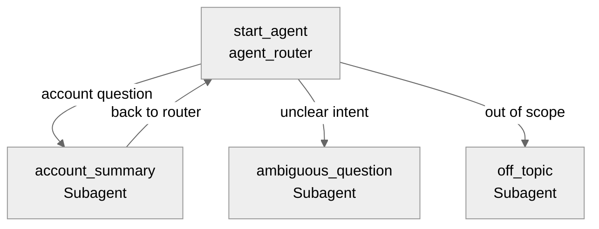

# Agent Spec: Account_Summarizer_Agent

## Purpose & Scope

An employee-facing agent for Field Sales Reps that provides AI-powered account summaries. It automatically detects the account from the record page context, or resolves the account from the user's prompt if no record context is available.

## Behavioral Intent

- The agent should call `FSRAskAboutAccountAction` for ANY question about an account or HCP.
- If the user is on an Account record page, the agent automatically passes the Account ID to the action — no need to ask the user.
- If the user is NOT on a record page, the agent extracts the account name from the user's question and passes it to the action.
- The agent should present the returned summary directly as text, never calling show_command.
- The agent should not fabricate account information — all data comes from the action output.
- Single-subagent architecture — all interactions stay within the account summarization domain.

## Subagent Map

## Variables

- `record_id` (linked string, source: @record.Id) — The record ID from the current page context. Empty if user is not on a record page.
- `account_name` (mutable string = "") — The resolved account name, set from action output.

## Actions & Backing Logic

### ask_about_account (account_summary subagent)

- **Target:** `apex://FSRAskAboutAccountAction`
- **Backing Status:** EXISTS

#### Inputs

| Name | Type | Required | Source |
|------|------|----------|--------|
| question | string | No | LLM slot-fill from user utterance |
| accountId | string | No | Bound to @variables.record_id (linked from record page) |
| accountName | string | No | LLM slot-fill (account/HCP name from prompt) |

#### Outputs

| Name | Type | Visible to User? | Notes |
|------|------|-------------------|-------|
| output | string | Yes | AI-generated account summary |
| accountName | string | Yes | Resolved account name |

## Gating Logic

No gating required — the action handles missing account context internally with fallback logic (question parsing → recently viewed).

## Architecture Pattern

Hub-and-spoke with a single domain subagent. The `agent_router` routes to `account_summary` for any account-related question, plus standard guardrail subagents for off-topic and ambiguous requests.

## Agent Configuration

- **developer_name:** `Account_Summarizer_Agent`
- **agent_label:** `Account Summarizer`
- **agent_type:** `AgentforceEmployeeAgent`
- **default_agent_user:** N/A — employee agent (runs as logged-in user)
